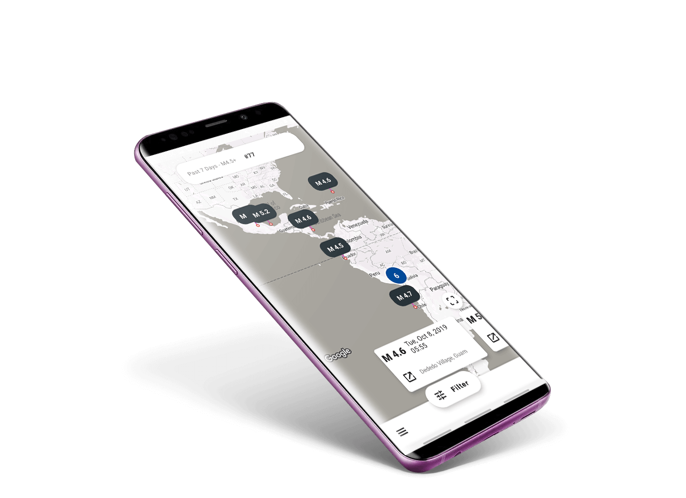
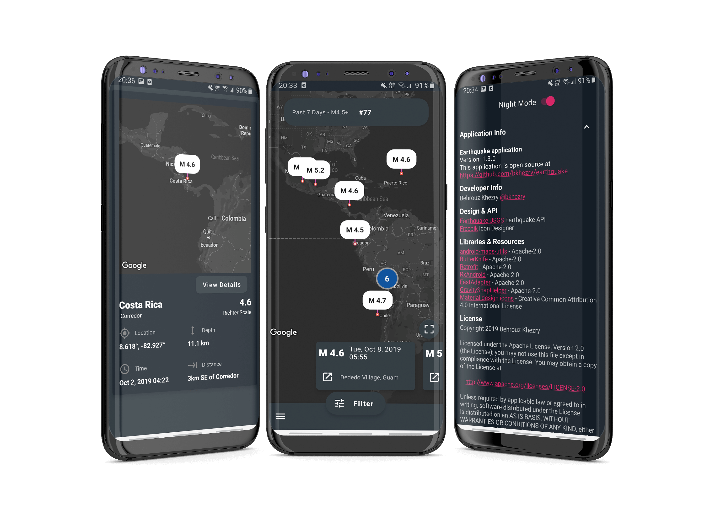

# Earthquake App

**Requirements**
- Android Studio 4.0.2
- JDK 8
- Android SDK 30
- Supports API Level +21
- Material Components 1.3.0-alpha03

**Highlights**
- Use [USGS Earthquake] API
- Use Material Design 2
- Dark Mode

**Demo** application is available in [Release]

**Screenshot**

**Libraries & Dependencies**
- [android-maps-utils]: Handy extensions to the Google Maps Android API
- [GravitySnapHelper]: A SnapHelper that snaps a RecyclerView to an edge
- [Support libraries]: appcompat / recyclerview / constraintlayout
- [Material Design 2]: MaterialCardView / MaterialButton / Bottom App Bars / ExtendedFloatingActionButton
- [FastAdapter]: The bullet proof, fast and easy to use adapter library, which minimizes developing time to a fraction
- Square [Retrofit] / [Okhttp] / [Logging-Interceptor]
- [RxAndroid] Reactive Extensions for Android
- [Firebase Core] / Crashlytics

### Development Setup
Before you start, make sure that you have added your Google Maps API key by following the instructions in `app/src/debug/res/values/google_maps_api.xml`

**Credit**

### [Freepik] Icon Designer 

# License

    Copyright 2019 Behrouz Khezry

    Licensed under the Apache License, Version 2.0 (the "License");
    you may not use this file except in compliance with the License.
    You may obtain a copy of the License at

       http://www.apache.org/licenses/LICENSE-2.0

    Unless required by applicable law or agreed to in writing, software
    distributed under the License is distributed on an "AS IS" BASIS,
    WITHOUT WARRANTIES OR CONDITIONS OF ANY KIND, either express or implied.
    See the License for the specific language governing permissions and
    limitations under the License.

[android-maps-utils]: https://github.com/googlemaps/android-maps-utils
[GravitySnapHelper]: https://github.com/rubensousa/GravitySnapHelper
[freepik]: https://www.flaticon.com/authors/freepik
[USGS Earthquake]: https://earthquake.usgs.gov/earthquakes/feed/v1.0/geojson.php
[Support libraries]: https://developer.android.com/jetpack/androidx/
[Material Design 2]: https://material.io/develop/android/
[FastAdapter]: https://github.com/mikepenz/FastAdapter
[Retrofit]: https://github.com/square/retrofit
[Okhttp]: https://github.com/square/okhttp
[Logging-Interceptor]: https://github.com/square/okhttp/tree/master/okhttp-logging-interceptor
[RxAndroid]: https://github.com/ReactiveX/RxAndroid
[Firebase Core]: https://firebase.google.com/
[Release]: https://github.com/bkhezry/earthquake/releases
